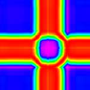
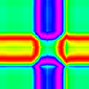

## Gramian Angular Field

A Gramian Angular Field is an image obtained from a time series, representing some temporal correlation between each time point. Two methods are available: Gramian Angular Summation Field and Gramian Angular Difference Field. This example illustrates the transformation on the first sample of the GunPoint dataset.




`$ npm install gramian-angular-field`

**Use in your own program**

```typescript
import { gramianAngularField } from "gramian-angular-field";
import { gunPoint } from './gun-point';

gramianAngularField(gunPoint).write('gun-point.png');
```